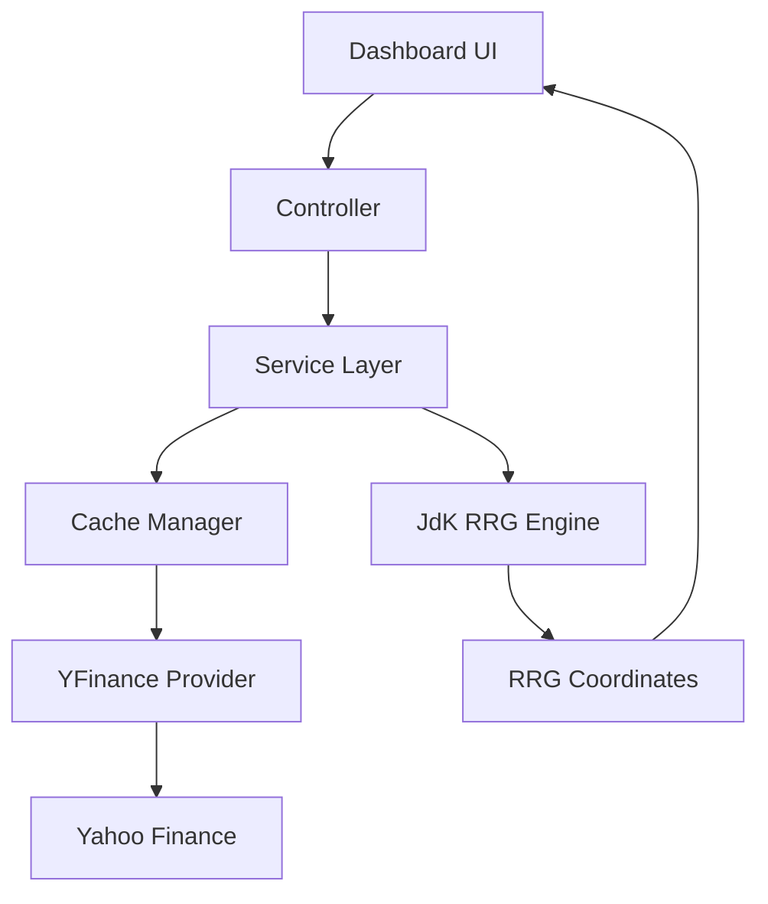

# Relative Rotation Graph Dashboard

A Python-based interactive Relative Rotation Graph (RRG) dashboard for analyzing sector rotation and benchmark-relative strength across Indian equity market indices.

The dashboard visualizes how industry sectors rotate across market cycles relative to a benchmark (such as NIFTY 50, NIFTY 500, or NIFTY Total Market), computing RS-Ratio and RS-Momentum metrics following Julius de Kempenaer's Relative Rotation Graph methodology.

---

## Overview

A Relative Rotation Graph (RRG) maps the relative performance of multiple securities or sector indices on a two-dimensional plane:

- **Horizontal Axis (RS-Ratio):** Measures the relative strength of a sector index against the chosen benchmark. An RS-Ratio above 100 indicates outperformance relative to the benchmark; an RS-Ratio below 100 indicates underperformance.
- **Vertical Axis (RS-Momentum):** Measures the rate of change of relative strength. An RS-Momentum above 100 indicates positive, accelerating momentum; an RS-Momentum below 100 indicates decelerating or negative momentum.
- **Four Quadrants:**
  - **Leading (Top-Right):** RS-Ratio > 100, RS-Momentum > 100. Strong relative performance with positive momentum.
  - **Weakening (Bottom-Right):** RS-Ratio > 100, RS-Momentum ≤ 100. Still outperforming the benchmark, but positive momentum is fading.
  - **Lagging (Bottom-Left):** RS-Ratio ≤ 100, RS-Momentum ≤ 100. Underperforming the benchmark with negative momentum.
  - **Improving (Top-Left):** RS-Ratio ≤ 100, RS-Momentum > 100. Still underperforming the benchmark, but momentum is turning positive toward a potential recovery.
- **Rotational Trajectory:** Over complete market cycles, sectors typically rotate in a clockwise path:
  $$\text{Improving} \longrightarrow \text{Leading} \longrightarrow \text{Weakening} \longrightarrow \text{Lagging} \longrightarrow \text{Improving}$$
- **Historical Trails:** Multi-period tails illustrate each sector's direction, curvature, and velocity through time.

---

## Features

The dashboard provides a rich set of interactive analytics tools:

- **Sector RRG Visualization:** Interactive four-quadrant scatter chart with quadrant color-coding, grid crosshairs at (100, 100), and dynamic sector node markers.
- **Multiple Timeframe Analysis:** Switch between **Daily**, **Weekly**, and **Monthly** timeframes with canonical rolling window configurations.
- **Benchmark Selection:** Compare sectors against standard benchmarks (**NIFTY 50**, **NIFTY 500**, or **NIFTY TOTAL MARKET**).
- **Historical Timeline Scrubber:** Full timeline slider allowing users to scrub to any historical frame in the dataset.
- **Animation Playback Controls:**
  - **Play / Pause:** Continuous animation cycling through historical periods.
  - **Frame Stepping:** **First** (⏮), **Previous** (◀), **Next** (▶), and **Last** (⏭) navigation buttons for granular frame-by-frame analysis.
  - **Playback Speed:** Configurable animation speed (0.5x, 1x, 2x, 4x intervals).
- **Configurable Trail Length:** Adjust historical trail tail length from 1 to 20 periods via slider to highlight recent velocity or long-term paths.
- **Interactive Sector Legend:**
  - Click any sector pill in the legend to toggle or isolate visibility.
  - **Show All** and **Hide All** buttons for rapid multi-sector comparison.
- **Search and Filter:** Real-time text search filter to highlight or isolate specific sector groups.
- **Hover & Tooltip Inspection:** Rich hover details showing current sector name, exact RS-Ratio, RS-Momentum, quadrant, and observation date.
- **Zoom & Pan Navigation:** Full Plotly interactive canvas supporting box zoom, pan, scroll zoom, and axis autoscale.
- **Chart Export:** Direct vector SVG chart export via the graph mode bar (`RRG_Export.svg`).
- **Interactive Sector Data Table:** Real-time data table displaying active Sector, Quadrant, RS-Ratio, RS-Momentum, Trend, and Composite Rank, with native column sorting.
- **Local Parquet Caching:** Local Apache Parquet data cache paired with SQLite metadata to eliminate redundant external API requests and accelerate startup.
- **Browser-Side Rendering:** Client-side JavaScript callbacks handle timeline frame updates, quadrant counter recalculation, and table synchronization without round-trip server latency.

---

## Architecture

The project adheres to a modular architecture with clear separation of concerns across presentation, orchestration, caching, data access, and quantitative computation.



### Component Layers

| Layer | Implementation Files | Responsibility |
|---|---|---|
| **Dashboard UI** | `dashboard/layout.py`, `dashboard/styles.py`, `assets/*` | Dash layout, CSS stylesheet, Plotly chart configuration, and client-side JavaScript controllers. |
| **Controller** | `dashboard/callbacks.py`, `dashboard/animation.py` | Server-side Dash callbacks and client-side callback registrations for user interactions and playback. |
| **Service Layer** | `services/rrg_service.py` | Coordinates data retrieval, invokes engine calculations, and serializes frame datasets into JSON-ready stores. |
| **Cache Manager** | `cache/cache_manager.py` | Reads/writes local daily Parquet files (`data/daily/`) and tracks dataset timestamps in SQLite (`data/cache_metadata.db`). |
| **Data Provider** | `providers/yfinance_provider.py`, `providers/provider_manager.py` | Fetches historical OHLC prices from Yahoo Finance, validates schema compliance, and manages fallback providers. |
| **JdK RRG Engine** | `engine/jdk_engine.py`, `engine/rs_calculator.py`, `engine/momentum.py`, `engine/normalization.py`, `engine/timeframe.py` | Resamples OHLC series, aligns dates, computes Raw RS, standardizes RS-Ratio and RS-Momentum, applies EMA smoothing, and calculates vectors. |

---

## Data Pipeline

```
Yahoo Finance (Market Data)
          ↓
YFinanceProvider (Historical OHLC extraction & symbol mapping)
          ↓
CacheManager (Staleness evaluation -> writes to data/daily/*.parquet & cache_metadata.db)
          ↓
RRGService (Coordinates time windows across benchmark and sector basket)
          ↓
JdKEngine (Resampling -> Raw RS -> RS-Ratio -> RS-Momentum -> EMA Smoothing -> Alignment)
          ↓
Frame Store (Serialized RRG coordinate matrices stored in dcc.Store)
          ↓
Browser Client (Client-side JavaScript animates Plotly canvas & updates table)
```

> **Data Provider Note:** The application uses Yahoo Finance (`yfinance`) as its primary data provider for benchmark and sector index series. The provider interface (`providers/provider_interface.py`) allows additional data adapters to be plugged in if required.

---

## Technology Stack

- **Language:** Python 3.9+
- **Frontend / Dashboard:** Plotly Dash (`dash>=2.14.0`)
- **Charting Engine:** Plotly Graph Objects (`plotly>=5.18.0`)
- **Data Computation:** Pandas (`pandas>=2.0.0`), NumPy (`numpy>=1.24.0`)
- **Data Provider:** `yfinance>=0.2.35`
- **Storage & Caching:** Apache Parquet via PyArrow (`pyarrow>=14.0.0`), SQLite (`sqlite3`)
- **Network / HTTP:** Requests (`requests>=2.31.0`)
- **Client-Side Scripts:** Vanilla JavaScript (ES6+), Vanilla CSS3
- **Automated Testing:** Pytest (`pytest>=7.4.0`)

---

## Project Structure

```
.
├── assets/                       # Client-side JavaScript, CSS stylesheets, and UI assets
│   ├── 00_state.js               # Global client-side state
│   ├── animation.js              # Timeline playback, frame stepping, and timer hooks
│   ├── graph.js                  # Plotly canvas update and frame rendering
│   ├── legend.js                 # Sector legend click and toggle handlers
│   ├── search.js                 # Real-time sector search filter
│   ├── styles.css                # Dark-theme CSS design system
│   └── table.js                  # Sector data table synchronization
├── cache/                        # Local data caching layer
│   ├── __init__.py
│   └── cache_manager.py          # Parquet storage and SQLite metadata manager
├── config/                       # Configuration parameters
│   ├── __init__.py
│   ├── animation.py              # Playback timing constants
│   ├── cache.py                  # Storage directories and cache freshness TTL
│   ├── engine.py                 # RRG calculation window parameters
│   ├── indices.py                # Benchmark and sectoral index ticker definitions
│   └── ui.py                     # Quadrant color palette and UI constants
├── dashboard/                    # Application dashboard package
│   ├── __init__.py
│   ├── animation.py              # Client-side callback registration & base figure builder
│   ├── app.py                    # Dash application factory
│   ├── callbacks.py              # Server-side Dash callbacks
│   ├── layout.py                 # Component layout tree
│   └── styles.py                 # Style helper constants
├── engine/                       # Mathematical calculation engine
│   ├── __init__.py
│   ├── base.py                   # Engine interfaces and result data structures
│   ├── jdk_engine.py             # Complete JdK computation pipeline
│   ├── momentum.py               # Rate of change and momentum calculations
│   ├── normalization.py          # Rolling Z-score normalization
│   ├── rs_calculator.py          # Raw Relative Strength calculation
│   └── timeframe.py              # Resampling and timeframe alignment
├── providers/                    # Market data providers
│   ├── __init__.py
│   ├── bhavcopy_provider.py      # Direct NSE Bhavcopy archive provider (fallback)
│   ├── provider_interface.py     # Base provider interface
│   ├── provider_manager.py       # Provider orchestrator with validation checks
│   └── yfinance_provider.py      # Yahoo Finance data provider
├── services/                     # Application service layer
│   ├── __init__.py
│   └── rrg_service.py            # High-level RRG service orchestrator
├── tests/                        # Automated test suite
│   ├── fixtures/                 # Test CSV datasets and validation specifications
│   ├── test_jdk_engine.py        # JdK Engine pipeline tests
│   ├── test_momentum.py          # Momentum calculation tests
│   ├── test_normalization.py     # Normalization and Z-score tests
│   ├── test_numerical_stability.py# Numerical stability and edge case tests
│   ├── test_rs_calculator.py     # Relative strength calculation tests
│   ├── test_timeframe.py         # Timeframe resampling tests
│   └── validate_real_world.py    # End-to-end validation with live market data
├── utils/                        # Utility package
│   ├── __init__.py
│   └── logger.py                 # Structured file and console logger
├── .env.example                  # Environment configuration template
├── .gitignore                    # Git ignore specifications
├── benchmark.py                  # Engine calculation speed benchmark script
├── requirements.txt              # Production and testing dependencies
├── run_dashboard.py              # Application entry point
└── README.md                     # Project documentation
```

---

## Installation

### 1. Clone the Repository

```bash
git clone https://github.com/<username>/<repository>.git
cd <repository>
```

### 2. Set Up a Virtual Environment

**Windows (PowerShell):**
```powershell
python -m venv venv
.\venv\Scripts\Activate.ps1
```

**Windows (Command Prompt):**
```cmd
python -m venv venv
venv\Scripts\activate.bat
```

**macOS / Linux:**
```bash
python3 -m venv venv
source venv/bin/activate
```

### 3. Install Dependencies

```bash
pip install -r requirements.txt
```

---

## Running the Dashboard

Start the application:

```bash
python run_dashboard.py
```

On startup, the system will:
1. Verify system timezone settings.
2. Initialize runtime cache folders (`data/daily/`, `data/weekly/`, `data/monthly/`, `logs/`) automatically.
3. Validate configured market symbols against Yahoo Finance.
4. Report cached ticker statistics.
5. Launch the Dash web server on port 8050.

Open your browser and navigate to:
```
http://127.0.0.1:8050
```

To allow other devices on your local network to view the dashboard, navigate to `http://<YOUR_LOCAL_IP>:8050`.

---

## Configuration

Settings are centrally defined in `config/`:

- **`config/engine.py`**: Calculation parameters and rolling window lengths:
  - **Daily:** RS-Ratio window = 52, RS-Momentum window = 70
  - **Weekly:** RS-Ratio window = 10, RS-Momentum window = 14
  - **Monthly:** RS-Ratio window = 6, RS-Momentum window = 8
- **`config/indices.py`**: Benchmark index definitions (`NIFTY 50`, `NIFTY 500`, `NIFTY TOTAL MARKET`) and sectoral indices (`NIFTY BANK`, `NIFTY IT`, `NIFTY AUTO`, `NIFTY PHARMA`, `NIFTY FMCG`, `NIFTY METAL`, `NIFTY ENERGY`, `NIFTY REALTY`, `NIFTY INFRA`, `NIFTY MEDIA`, `NIFTY PSU BANK`, `NIFTY CONSUMPTION`, `NIFTY SERVICES SECTOR`).
- **`config/cache.py`**: Storage directory paths and data freshness window (`CACHE_FRESHNESS_HOURS = 6`).

No external API keys or access tokens are required for the standard Yahoo Finance configuration. See `.env.example` for optional server host/port overrides.

---

## Caching Strategy

The dashboard utilizes a two-tier local caching mechanism:

1. **Parquet Storage:** Historical daily OHLC bars are stored in columnar Apache Parquet format under `data/daily/<ticker>.parquet`. Columnar compression provides fast read access and low storage overhead.
2. **Metadata Tracking:** A lightweight SQLite database (`data/cache_metadata.db`) maintains timestamps, row counts, and date coverage for each symbol.
3. **Freshness Checks:** If cached data is within `CACHE_FRESHNESS_HOURS` (default: 6 hours), the application loads directly from disk without making network requests.
4. **Git Exclusion:** All generated cache files and SQLite databases are excluded from version control via `.gitignore`. The directory hierarchy is created automatically on first run.

---

## RRG Methodology

The mathematical methodology follows standard Relative Rotation Graph principles:

1. **Raw Relative Strength ($RS$):**
   $$RS(t) = \frac{\text{Sector Close}(t)}{\text{Benchmark Close}(t)}$$

2. **RS-Ratio ($RSR$):**
   Standardizes the raw relative strength series around a baseline of 100 using rolling mean and population standard deviation ($\text{ddof}=0$):
   $$RSR(t) = 100 + \frac{RS(t) - \mu_{RS}(t)}{\sigma_{RS}(t) + \epsilon}$$

3. **Rate of Change ($ROC$):**
   Measures the period-over-period change of relative strength:
   $$ROC(t) = \frac{RSR(t) - RSR(t-1)}{RSR(t-1)}$$

4. **RS-Momentum ($RSM$):**
   Standardizes the Rate of Change to center momentum around 100:
   $$RSM(t) = 100 + \frac{ROC(t) - \mu_{ROC}(t)}{\sigma_{ROC}(t) + \epsilon}$$

5. **Noise Reduction:**
   An Exponential Moving Average ($EMA$, span = 5) is applied to both $RSR$ and $RSM$ series to eliminate transient high-frequency jitter while preserving the underlying rotational path.

6. **Quadrant Classification:**
   - **Leading:** $RSR > 100 \text{ and } RSM > 100$
   - **Weakening:** $RSR > 100 \text{ and } RSM \le 100$
   - **Lagging:** $RSR \le 100 \text{ and } RSM \le 100$
   - **Improving:** $RSR \le 100 \text{ and } RSM > 100$

---

## Performance Benchmark

The computational engine utilizes vectorized NumPy and Pandas calculations. Benchmark computation time using:

```bash
python benchmark.py
```

*Typical benchmark result:* Computing 13 sectoral indices across historical weekly periods completes in ~70–110 ms on standard desktop hardware once market data is cached.

---

## Testing

Run the automated test suite with `pytest`:

```bash
pytest
```

The test suite covers:
- Complete JdK calculation pipeline execution
- RS-Momentum rate of change and smoothing
- Rolling Z-score normalization
- Numerical stability with zero variance and edge conditions
- Multi-timeframe resampling (Daily, Weekly, Monthly)

To run end-to-end validation against live market data from Yahoo Finance:

```bash
python tests/validate_real_world.py
```

---

## Troubleshooting

### 1. PowerShell Script Execution Policy (Windows)
If executing `Activate.ps1` in PowerShell produces a script execution restriction error:
```powershell
Set-ExecutionPolicy -ExecutionPolicy RemoteSigned -Scope CurrentUser
```

### 2. Network Timeouts / Yahoo Finance Rate Limits
If market data fetching fails during initial startup:
- Ensure your internet connection is active.
- Yahoo Finance may occasionally throttle high-frequency requests. Retry after a short pause or inspect `logs/provider.log`.

### 3. Missing Dependencies
Ensure the virtual environment is activated before running:
```bash
pip install -r requirements.txt
```

---

## Security

- Never commit `.env` or machine-specific credentials to source control.
- Generated cache files (`data/`) and runtime log files (`logs/`) are excluded from Git.
- This application runs entirely locally and requires no elevated privileges or inbound open ports other than the local Dash server.

---

## Disclaimer

This software is for educational, research, and personal analytical purposes only. It does not constitute investment, trading, or financial advice. Market data may be delayed, incomplete, or subject to provider limitations. Do not make investment decisions solely based on this application.

---

## Roadmap

- [ ] Support for custom user-defined equity baskets and global benchmarks.
- [ ] Export RRG coordinates and quadrant histories directly to CSV/Excel.
- [ ] Pluggable market data provider extensions.
- [ ] Custom styling themes and layout configurations.

---

## License

This project is licensed under the [MIT License](LICENSE).
